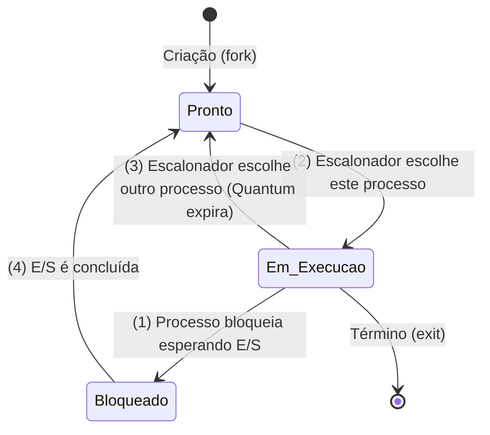

# Especificação de Projeto: Simulador de Gerenciamento de Processos

## 1. Visão Geral e Arquitetura do Simulador

O objetivo deste simulador é materializar os conceitos de **multiprogramação** e o **modelo de processo**, simulando um ambiente onde a CPU alterna rapidamente entre diversos programas (pseudoparalelismo).

O sistema operará mantendo a ilusão de que processos sequenciais rodam paralelamente. Para isso, o simulador implementará:
- **CPU Virtual:** Que simula a execução através de um relógio lógico (clock). Ela deve manter o controle dos **registradores** e do **contador de programa (PC)** do processo que está atualmente de posse da CPU.
- **Chaveamento de Contexto (Context Switch):** Mecanismo principal do simulador, que irá salvar os registradores e o PC de um processo quando este perder a CPU, e restaurar o contexto do próximo processo a ser executado.

---

## 2. Especificação do Bloco de Controle de Processo (PCB) e Tabela de Processos

Para gerenciar os processos, o sistema operacional (simulado) manterá uma estrutura de dados central chamada **Tabela de Processos**, cujas entradas são os **Blocos de Controle de Processo (PCBs)**.

### Estrutura do PCB
Conforme fundamentado no capítulo 2, para que um processo suspenso possa ser reiniciado no exato estado em que foi interrompido, o PCB conterá as seguintes informações vitais:
* **Identificação:** Identificador único do processo (PID).
* **Gerenciamento de Processo:** 
  * Estado atual do processo (Pronto, Em Execução ou Bloqueado).
  * Contexto (valores simulados dos registradores e do Contador de Programa - PC).
  * Prioridade (necessária para algoritmos de escalonamento não-circulares).
* **Contabilidade e Tempos:**
  * Tempo de CPU consumido.
  * Tempo de espera.

---

## 3. Ciclo de Vida e Grafo de Transição de Estados

O simulador implementará o modelo clássico de **Três Estados**, focado inteiramente em como os processos se comportam em relação à CPU e aos eventos de E/S. O ciclo de vida base (além da criação via "fork" e término via "exit") flutua entre estes 3 estados principais:

### Transições de Estado:
1. **Em Execução $\rightarrow$ Bloqueado (Transição 1):** Ocorre quando o processo solicita voluntariamente uma operação de Entrada/Saída fictícia e não pode continuar até que ela termine.
2. **Pronto $\rightarrow$ Em Execução (Transição 2):** Disparado quando o escalonador de CPU decide que é a vez de este processo rodar e lhe atribui a CPU virtual.
3. **Em Execução $\rightarrow$ Pronto (Transição 3):** Ocorre compulsoriamente via interrupção de relógio (expiração do quantum). O processo ainda quer usar a CPU, mas é suspenso para que outro possa rodar.
4. **Bloqueado $\rightarrow$ Pronto (Transição 4):** Ocorre quando o evento externo (E/S) pelo qual o processo esperava é concluído.

---

## 4. Especificação do Escalonador de CPU

Quando mais de um processo está no estado *Pronto*, o sistema deve decidir qual deles receberá a CPU. O simulador implementará dois dos principais algoritmos de escalonamento iterativos:

### 4.1. Circular (Round Robin)
- **Mecanismo:** Cada processo recebe um intervalo de tempo fixo chamado **quantum**. 
- **Estrutura:** O escalonador mantém uma lista (fila) de processos prontos. Quando o quantum de um processo expira, ele é preterido e colocado no final da fila, e a CPU é dada ao processo que está no início da fila.

### 4.2. Escalonamento por Prioridades (Com prevenção de inanição)
- **Mecanismo:** A cada processo é atribuída uma prioridade. O processo *Pronto* com a prioridade mais alta recebe a CPU.
- **Prevenção de Inanição (Starvation):** Para evitar que processos de baixa prioridade fiquem rodando eternamente à espera (inanição) caso processos de alta prioridade não parem de chegar, o simulador implementará um mecanismo dinâmico. A prioridade do processo em execução será reduzida (envelhecimento) a cada interrupção do relógio, garantindo que eventualmente outros processos ganhem a CPU.

---

## 5. Entradas, Casos de Teste e Diretrizes de Entrega

O simulador lerá as configurações iniciais de um arquivo texto simulando a carga de trabalho (*workload*). 

**Arquivo de Tarefas:**
Cada linha do arquivo representará um processo e suas características (PID, tempo de chegada, surto total de CPU, prioridade, e instantes de solicitação de E/S).

**Saída e Estatísticas do Simulador:**
Após a simulação dos algoritmos acima, o sistema deverá gerar:
- Log das transições de estado (registrando as 4 transições clássicas ao longo dos ciclos).
- Gráfico de Gantt textual demonstrando a linha do tempo da CPU.
- Estatísticas de uso da CPU (Turnaround, Tempo de Espera e Utilização percentual).
