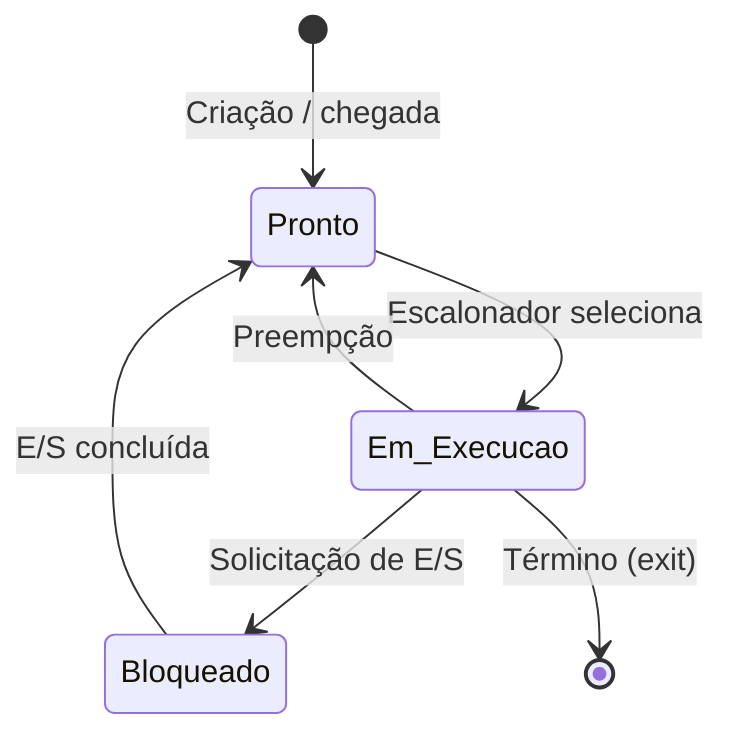

# Especificação de Projeto: Simulador de Gerenciamento de Processos

## 1. Visão Geral e Arquitetura

O projeto consiste em um simulador, executado em **modo usuário**, dos principais mecanismos de gerenciamento de processos de um sistema operacional. Os processos serão representados por estruturas de dados e executados de forma simulada por uma **CPU virtual** e um **relógio lógico**.

### Restrições de implementação

- **Linguagem:** Rust.
- **Dependências:** apenas a biblioteca padrão (`std`), sem crates externas.
- O simulador deverá ser executável por linha de comando.

### Componentes principais

- **CPU Virtual:** executa no máximo um processo por vez.
- **Relógio Lógico:** avança a simulação em unidades discretas chamadas *ticks*.
- **Tabela de Processos:** armazena os PCBs.
- **Fila de Prontos:** mantém processos aptos a executar.
- **Processos Bloqueados:** aguardam conclusão de E/S.
- **Escalonador:** escolhe o próximo processo.

### CPU Virtual

A CPU deverá possuir:

- `pc`: contador de programa;
- `registradores`: **4 registradores inteiros de propósito geral**, inicialmente zerados;
- `pid_atual`: PID do processo em execução ou ausência de processo;
- `quantum_usado`: ticks consumidos no quantum atual.

Cada operação `CPU:N` consome `N` ticks. Cada operação `IO:N` mantém o processo bloqueado por `N` ticks.

Quando não houver processo pronto ou em execução, a CPU ficará em `IDLE`, mas o relógio continuará avançando enquanto existirem processos futuros ou bloqueados.

### Chaveamento de contexto

Quando um processo deixa a CPU:

1. seu `pc` e seus 4 registradores são salvos no PCB;
2. seu estado é atualizado para **Pronto**, **Bloqueado** ou **Finalizado**.

Quando outro processo recebe a CPU:

1. seu estado muda de **Pronto** para **Em Execução**;
2. `pc` e registradores são restaurados;
3. `pid_atual` recebe seu PID;
4. `quantum_usado` é reiniciado quando necessário.

---

## 2. PCB e Tabela de Processos

Cada processo será representado por um **PCB (Process Control Block)** contendo, no mínimo:

| Campo | Descrição |
|---|---|
| `pid` | Identificador único |
| `estado` | Pronto, EmExecucao, Bloqueado ou Finalizado |
| `pc` | Contador de programa salvo |
| `registradores` | Vetor com 4 registradores inteiros |
| `prioridade_inicial` | Prioridade lida do arquivo de tarefas |
| `prioridade_atual` | Prioridade dinâmica usada pelo escalonador |
| `tempo_chegada` | Tick de chegada |
| `tempo_cpu` | Total de ticks executados |
| `tempo_espera` | Total de ticks no estado Pronto |
| `tempo_finalizacao` | Tick de término |
| `operacoes` | Sequência de operações CPU/E/S |
| `indice_operacao` | Operação atual |
| `restante_operacao` | Ticks restantes da operação atual |

Regras principais:

- cada PID deve ser único;
- no máximo um processo pode estar **Em Execução**;
- processos **Bloqueados** e **Finalizados** não podem receber a CPU;
- um processo não pode estar simultaneamente nas estruturas de Prontos e Bloqueados.

---

## 3. Ciclo de Vida e Transições de Estado

O simulador utilizará os estados **Pronto**, **Em Execução** e **Bloqueado**, além de **Finalizado** como estado terminal.



### Criação -> Pronto

Quando o relógio atingir o tempo de chegada:

1. o PCB é criado;
2. `pc`, registradores e tempos são inicializados em zero;
3. `prioridade_atual = prioridade_inicial`;
4. o processo entra no estado **Pronto**.

### Pronto -> Em Execução

Ocorre quando o escalonador seleciona o processo. Seu contexto é restaurado e ele passa a utilizar a CPU.

### Em Execução -> Pronto

Ocorre por preempção:

- no **Round Robin**, quando o quantum expira;
- por **Prioridade**, quando existe um processo Pronto com `prioridade_atual` maior.

O contexto é salvo e o processo retorna à estrutura de Prontos.

### Em Execução -> Bloqueado

Quando um surto de CPU termina e a próxima operação é `IO:N`, o processo:

1. salva seu contexto;
2. muda para **Bloqueado**;
3. permanece bloqueado por `N` ticks;
4. libera a CPU.

### Bloqueado -> Pronto

Quando a E/S termina, o processo retorna para **Pronto** e poderá ser escalonado novamente.

### Em Execução -> Finalizado

Quando a última operação de CPU termina, o processo executa `exit`, registra seu tempo de finalização e não poderá voltar à execução.

---

## 4. Escalonadores de CPU

O simulador deverá permitir selecionar entre **Round Robin** e **Prioridade Dinâmica**.

### 4.1 Round Robin

- Utiliza uma fila **FIFO** de processos Prontos.
- Cada processo recebe um quantum fixo maior que zero.
- Quando o quantum expira e ainda há CPU a executar, o processo volta para o fim da fila.
- Se o processo bloquear ou finalizar antes do quantum, o restante do quantum é descartado.
- A conclusão de uma E/S não interrompe o processo atualmente em execução antes do fim de seu quantum.

### 4.2 Prioridade Dinâmica

A convenção adotada será:

> **quanto maior o número, maior a prioridade.**

O escalonador selecionará o processo Pronto com maior `prioridade_atual`. Em caso de empate entre processos Prontos, será usada a ordem FIFO.

O algoritmo será **preemptivo**. Para reduzir o risco de inanição, o processo que está usando a CPU sofre uma pequena punição de prioridade:

1. `prioridade_atual` inicia com o valor de `prioridade_inicial`;
2. a cada tick de CPU executado, a `prioridade_atual` do processo em execução é decrementada em 1;
3. após o tick, se o processo continuar apto a executar e existir um processo Pronto com prioridade maior, ocorre preempção;
4. a prioridade reduzida é mantida caso o processo volte posteriormente à fila de Prontos.

A `prioridade_atual` é um inteiro com sinal e pode assumir valores negativos.

> **Observação:** este mecanismo não será chamado de *aging*. Neste projeto, a redução da prioridade do processo em execução é usada apenas como mecanismo de prevenção de inanição no escalonamento por prioridades.

---

## 5. Entrada, Saída e Casos de Teste

### 5.1 Arquivo de tarefas

Cada linha deverá seguir o formato:

```text
PID;CHEGADA;PRIORIDADE;OPERACOES
```

Exemplo:

```text
1;0;3;CPU:5,IO:3,CPU:4
2;2;1;CPU:3,IO:2,CPU:6
3;4;2;CPU:8
```

Regras:

- `PID`, `CHEGADA` e `PRIORIDADE` devem ser inteiros válidos;
- toda duração `N` deve ser maior que zero;
- a primeira e a última operação devem ser `CPU`;
- operações devem alternar entre `CPU` e `IO`;
- **duas operações consecutivas do mesmo tipo são inválidas**. Caso representem um único surto, suas durações devem ser somadas previamente. Exemplo: `CPU:2,CPU:3` deve ser escrito como `CPU:5`.

### 5.2 Parâmetros

O simulador deverá receber por linha de comando:

- arquivo de tarefas;
- algoritmo: `rr` ou `prioridade`;
- `quantum`, quando usado Round Robin.

### 5.3 Saída

O simulador deverá apresentar:

**Log de transições**, contendo pelo menos tick, PID, estado anterior, estado seguinte e motivo.

```text
[t=2] PID=1 EXECUTANDO -> BLOQUEADO motivo=IO
```

**Gantt textual:**

```text
| 0-2:P1 | 2-4:P2 | 4-6:P1 |
```

Períodos ociosos deverão aparecer como `IDLE`.

**Estatísticas:**

- tempo de CPU por processo;
- tempo de espera;
- turnaround (`tempo_finalizacao - tempo_chegada`);
- tempo total da simulação;
- utilização percentual da CPU.

### 5.4 Casos de teste mínimos

#### Teste 1 — Round Robin

```text
quantum = 2
1;0;1;CPU:4
2;0;1;CPU:3
```

Gantt esperado:

```text
| 0-2:P1 | 2-4:P2 | 4-6:P1 | 6-7:P2 |
```

#### Teste 2 — E/S

```text
quantum = 2
1;0;1;CPU:2,IO:3,CPU:2
2;0;1;CPU:4
```

Deve ocorrer a sequência **Em Execução -> Bloqueado -> Pronto** para P1.

#### Teste 3 — Prioridade

```text
1;0;3;CPU:4
2;1;4;CPU:2
```

P1 executa o primeiro tick e sua prioridade atual cai de 3 para 2. Quando P2 chega no tick 1 com prioridade 4, deve preemptar P1.

#### Teste 4 — Prevenção de inanição

```text
1;0;4;CPU:10
2;0;1;CPU:2
```

P1 começa executando por possuir maior prioridade. Sua prioridade é reduzida em 1 a cada tick. Após quatro ticks executados, sua prioridade atual será 0; como P2 permanece Pronto com prioridade 1, P2 deverá receber a CPU.

### 5.5 Término e entrega

A simulação termina quando todos os processos tiverem sido finalizados e não houver processos Prontos, Bloqueados, Em Execução ou aguardando chegada.

A especificação deverá ser entregue em **Markdown**, publicada no GitHub de cada integrante e utilizada como entrada para o Harness de geração de código. A implementação gerada deverá respeitar as regras definidas neste documento, sem decidir por conta própria aspectos fundamentais como linguagem, dependências, estados, escalonamento ou formato da entrada.
